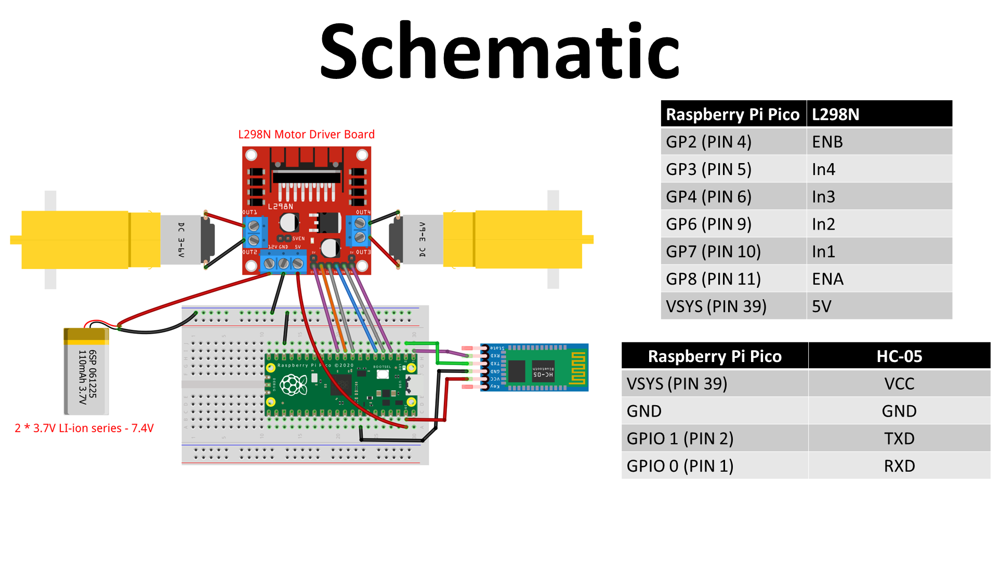

# Bluetooth-Controlled Raspberry Pi Pico Car with Object Detection

This project is a Bluetooth-controlled car built with a Raspberry Pi Pico. The car can be controlled wirelessly via a smartphone app, and it also features an object detection system to identify different types of soda cans using a pre-trained YOLOv8 model.

## Features

- **Wireless Control:** Control the car's movement (forward, backward, left, right) and speed using a Bluetooth-enabled smartphone application.
- **Object Detection:** A YOLOv8 model trained to detect and classify different soda cans ("7UP", "Big", "Coke", "EST", "Fanta", "Pepsi", and "Sprite").
- **Raspberry Pi Pico:** The core of the project, handling the control logic for the car's motors.

## Hardware Components

- Raspberry Pi Pico
- L298N Motor Driver
- DC Motors
- Car Chassis
- Wheels
- Bluetooth Module (like HC-05 or HC-06)
- Power Source (Battery Pack)
- Jumper Wires

## Software and Libraries

- **MicroPython:** For programming the Raspberry Pi Pico.
- **YOLOv8:** For object detection.
- **Python:** For the object detection script.
- **Roboflow:** For dataset management and annotation for YOLOv8.
- **Smartphone App:** A custom app or a generic Bluetooth serial terminal app to send commands to the car.

## Circuit Diagram

The schematic for the project is as follows:



## Object Detection

The object detection model is trained using YOLOv8 on a custom dataset of soda cans. The notebook `notebooks/train-yolov8-object-detection-on-custom-dataset.ipynb` contains the complete code for training, validation, and testing the model.

The model can identify the following soda can brands:
- 7UP
- Big
- Coke
- EST
- Fanta
- Pepsi
- Sprite

## Demonstration

Here is an image of the car:


And a video of the car in action:

[Watch the Demo Video](Demo_test.mp4)

## Setup and Installation

### Raspberry Pi Pico Setup

1.  **Flash MicroPython:** If you haven't already, flash your Raspberry Pi Pico with the MicroPython firmware. You can find the instructions on the official Raspberry Pi website.
2.  **Upload `main.py`:** Copy the `main.py` file to your Raspberry Pi Pico. You can use an IDE like Thonny for this.
3.  **Connect Hardware:** Assemble the car chassis and connect the motors, motor driver, Bluetooth module, and Raspberry Pi Pico according to the circuit diagram.

### Object Detection Setup

1.  **Clone the repository:**
    ```bash
    git clone https://github.com/FiyinfoluwaDav/Bluetooth-Controlled-Raspberry-Pi-Pico-Car.git
    cd Bluetooth-Controlled-Raspberry-Pi-Pico-Car
    ```
2.  **Install dependencies:**
    ```bash
    pip install -r requirements.txt
    ```
    *(Note: You might need to create a `requirements.txt` file based on the libraries used in the notebook, such as `ultralytics`, `roboflow`, etc.)*

3.  **Run the notebook:** Open and run the `notebooks/train-yolov8-object-detection-on-custom-dataset.ipynb` notebook to train the model or use the pre-trained weights if available.

## Usage

1.  **Power On:** Power on the Raspberry Pi Pico and the motor driver.
2.  **Connect via Bluetooth:** Open your smartphone's Bluetooth settings and pair with the Bluetooth module on the car.
3.  **Control the Car:** Open a Bluetooth serial terminal app on your phone and connect to the paired device. Send the following commands to control the car:
    - `forward`: Move forward
    - `backward`: Move backward
    - `left`: Turn left
    - `right`: Turn right
    - `stop`: Stop the car
    - `E|{speed}`: Set the speed of the car, where `{speed}` is a value from 0 to 100. For example, `E|50` sets the speed to 50%.

## Contributing

Contributions are welcome! If you have any ideas, suggestions, or improvements, feel free to open an issue or create a pull request.

## License

This project is licensed under the MIT License. See the `LICENSE` file for more details.
